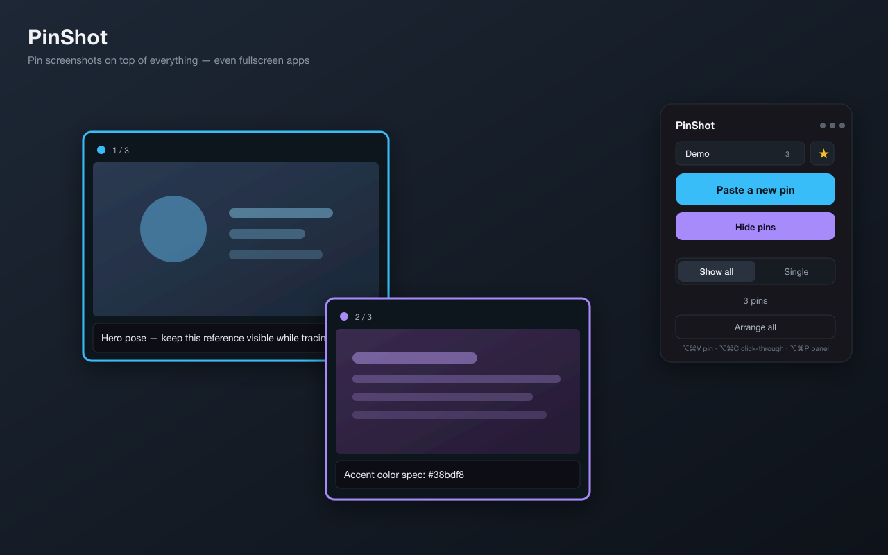

# PinShot 📌

Pin screenshots on top of everything. Copy any image to your clipboard, drop it
onto your screen as a floating pin that stays visible over **fullscreen apps**,
then resize / fade / move it — a reference-image HUD for tracing, comparing specs,
or keeping something in view while you work.

Built on a non-activating macOS `NSPanel` core, so pins float over other apps'
fullscreen Spaces and clicking them never steals focus from what you're doing.



## Use it

1. Take a screenshot **to the clipboard** — on macOS that's `⌃⇧⌘4` (Control-Shift-
   Command-4), or `⌃⇧⌘4` then Space for a window.
2. Click **Paste a new pin** on the control panel, or press **⌥⌘V** from
   anywhere. The image appears, floating on top.
3. Hover a pin for its toolbar:
   - **⤡ / ⤢** collapse to a thumbnail / expand
   - **− % +** zoom out / reset-to-fit / zoom in (or just **scroll** over it)
   - **opacity slider** — fade it to trace or compare against what's underneath
   - **⟳** replace this pin with whatever's on the clipboard now (update it)
   - **👆** click-through — let the mouse pass through to the app below
   - **✕** close
4. Drag a pin anywhere (even onto a fullscreen app on another monitor).

Pin up to **6** images at once.

### Show all vs. Single (carousel)

The control panel has a **Show all / Single** toggle:

- **Show all** — every pinned image is visible at the same time, each at the
  position you dragged it to. (Default.)
- **Single** — only one image shows at a time; use the **‹ ›** arrows (on the
  image and on the control panel) to cycle through your pins. The viewer stays in
  one place as you flip through them.

### Shortcuts

| Key | Action |
|-----|--------|
| `⌥⌘V` | Pin the current clipboard image |
| `⌥⌘C` | Toggle click-through on all pins (use this to *undo* click-through) |
| `⌥⌘P` | Show / hide the control panel |

A menu-bar tray icon mirrors these (New Pin, Show/Hide, Close All, Quit).

> **Click-through tip:** once a pin is click-through its hover toolbar can't be
> clicked. Press **⌥⌘C** (or use the per-pin toggle on the control panel) to turn
> it back off.

## Develop

```bash
npm install
npm run tauri dev      # live dev
./install.sh           # build + install to /Applications (re-signs the bundle)
```

After Rust changes: `cd src-tauri && cargo check`. After TS: `npm run build`.

See `CLAUDE.md` for the architecture (window pool, NSPanel conversion, clipboard →
PNG flow, sizing/anchor trick).
